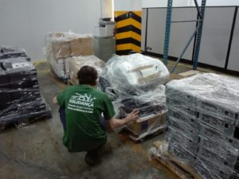
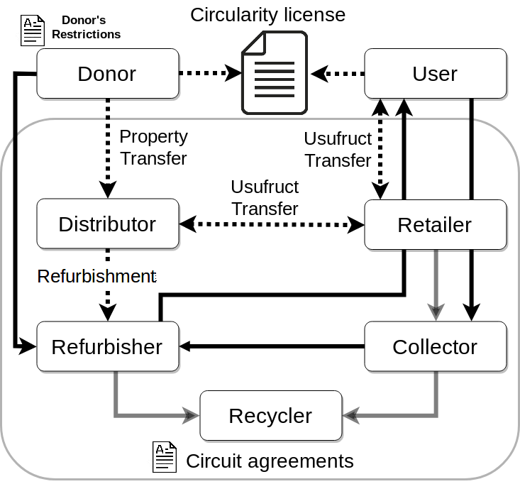

# R1.1 Concepte i Model de Negoci

## Introducció

### Context

Electronic reuse \(ereuse.org\) és una **comunitat de gestió col·lectiva** on els [participants ](https://github.com/reutilitza-cat/projecte-ajuntament-barcelona-2018/tree/8748c954ce56b4055426b960c372e9d56ee5511a/entregables/www.ereuse.org/community/README.md) intercanvien recursos procomuns per a fomentar la **reutilització**, la **traçabilitat** i el **reciclatge** final de dispositius digitals com ordinadors, portàtils o telèfons mòbils. Aquests recursos, en **format lliure i de codi obert**, i tot un seguit de **serveis distribuïts**, són utilitzats per vàries entitats que prèviament s'han federat a eReuse. Aquestes recursos són:

a\) **Eines tecnològiques**: per diagnosticar, inventariar, valoritzar i traçar dispositius digitals

b\) **Metodologies, convenis, models i protocols d'intercanvi de dades**: 

* **Metodologies** per certificar l'estat dels dispositius
* **Convenis tipus** per formalitzar donacions, intercanvis de productes i serveis i cessions en ususfructe a entitats receptores; 
* **Models** per a quantificar el valor d'ús i costos dels dispositius, i rendiments de circularitat dels dispositius i membres. 
* **Protocols d'intercanvi de dades de** traçabilitat entre els membres federats. **** 

Com a antecedents a eReuse, cal conèixer el projecte la **Xarxa de Suport a la reutilització d'equipament informàtic** \(Finançat pels ajuts PuntCat, any 2010\). El pilot de reutilització i preparació per a la reutilització d’equips informàtics \(**CORETIC**\), impulsat per la Generalitat de Catalunya \(any 2014, 2015\). El **projecte Europeu eReuse.org CHEST EU** \#611333 \(2015,2016\) que va contribuir al desenvolupament del programari, pilots i protocol de traçabilitat. El projecte **TaglSmart.eu EU** project 688061 \(2018\) que està contribuint a la realització de pilots i a l'etiquetatge intel·ligent dels dispotius. I el projecte d'enguany, impulsat per donacions de **Barcelona Activa** \(2017\) i **finançat per l'Ajuntament de Barcelona**.

Aquests projectes han suposat l’establiment d’una **metodologia compartida pel desenvolupament d’aquestes tasques, de les eines informàtiques corresponents**, de la **formació d’empreses d’economia social** i solidària en aquestes habilitats, i finalment a la **creació d’una xarxa d’entitats** de restauració i **intercanvi** d’equips informàtics.

Les entitats adherides a eReuse subscriuen una[ Llicència Circular](../annexes/llicencia-circular-delectronic-reuse.md),[ que s'està treballant aquí](https://reutilitza-cat.gitbook.io/projecte-ajuntament-barcelona-2018/annexes/llicencia-circular-delectronic-reuse), per assegurar que no es fa reciclatge prematur i que tot el que es reutilitza acaba reciclant-se formalment. Aquesta llicència estableix que el comú a preservar és la **informació de circularitat de la electrònica**. A grans trets, defineix **quina informació de circularitat ha de ser reportada** per tots els membres subscrits. És a dir, qualsevol membre que ha subscrit la llicència ha de fer pública la informació que demostra que ha aplicat bé la jerarquia de les 3R \(reduïr, reutilitzar, reciclar\); doncs com a eReuse entenem que només és circular desbastellar un dispositiu electrònic si abans s'ha intentat fer les accions de reparació, millora i reutilització.

### Qué?

Les entitats federades a eReuse es poden agrupar en **Circuits locals** i autònoms on els dispositius es gestionen i posseeixen de  **manera col·lectiva.  La propietat del dispositiu no resideix en l'usuari final, sinó en les comunitats.** El circuit es reserva la propietat per poder decidir el pas de producte a residu segons el denominat **valor d'us**. Quan aquest és molt baix per un dispositiu, o no té demanda, llavors s'envia a reciclar. 

Aquest projecte, finançat per l'Ajuntament de Barcelona, té l'objetiu de crear un circuit a Barcelona i àrea metropolitana que forma part dún circuit regional anomenat **eReuseCatalunya**. Es tracta d'un espai procomú, autònom, obert, gestionat democràticament i d'adhesió voluntaria, que integra a les entitats de l'economia circular, social i solidària en l'àmbit de l'electrònica \(mòbils, tauletes, portàtils o equips de sobretaula\).

Donat que totes les entitats integrades al circuit eReuseCatalunya estan federades a eReuse, i seguint el que hem dit al capítol del context sobre la llicència circular, el comú a preservar pel circuit és la **circularitat dels dispositius.** El circuit eReuseCatalunya compleix amb aquest **llicència circular,** així com amb l'anomenat acord de circuit que, a grans trets, recull el tema de la propietat col·lectiva i el manteniment del valor d'us dels dispositius, abans esmentades, i una sèrie de normes que permeten vetllar pels compromisos adquirits amb les entitats donants del circuit. Això vol dir ser capaç de reportar la cadena de custòdia \(tipologia d'actors i receptors que han restaurat els equips, costos d'aquisició per part del usuari final...

Un Circuit **pot fer ús del codi lliure del projecte Electronic Reuse** \(eReuse.org\) eReuse.org. **Aquest projecte promou el canvi cultural cap a la reparació, restauració i reutilització dels productes tecnològics evitant el seu reciclatge prematur i promovent la traçabilitat fins al reciclatge final.** 

La comunitat de eReuse.org es qui desenvolupa, manté i millora els recursos procomuns en format lliure i obert. Aquestes eines, serveis i dades ajuden, a les entitats i circuits federats, a optimitzar i certificar els processos i la traçabilitat dels dispositius durant el cicle de vida. Les eines estan desenvolupades en programari lliure i les entitats del circuit poden implementar-les per elles mateixes o accedir a proveïdors tecnològics, sempre federats a eReuse, que les creen i ofereixen en modalitat de serveis de programari.

### Per què?

#### Motius per a donar dispositius a un Circuit

Per a l'economia circular i social:

1. l’economia circular és especialment rellevant en el context dels dispositius digitals \(veure explicació a motius per a reutilitzar\)
2. enguany molts productes electrònics es reciclen abans d'hora, no obstant, hi ha entitats de l'economia social i solidària que els poden reparar, restaurar i canalitar a persones i entitats interessades en reaprofitar-los/reutilitzar-los.
3. en un model de comuns la propietat del dispositiu no resideix en l'usuari, sinó en la comunitat \(circuit\) que el custodia, que es responsabilitza de vetllar per la seva reutilització i  maximitzar el seu temps d'ús durant múltiples cicles de reutilització.

Per als donants en general, el donant:

1. fa un únic conveni de donació que li permet arribar a múltiples entitats d'economía circular l'ESS i receptores,
2. té accés a la cadena de custòdia; entitats d'economía circular \(proveïdores\) i entitats usuaries fins al reciclatge,
3. sap que els processos i la traçabilitat és certificada, no es pot modificar ni alterar,
4. pot personalitzar la donació; decidir qui distribueix, restaura, canalitza i reutilitza els dispositius,
5. sap que el cost que paga el receptor per adquirir-los està en funció dels costos \(distribució, magatzem, restauració, distribució,...\) i no pas del preu de mercat.

Per als donants tipus Administració Pública:

1. la donació al Circuit esta beneficiant a totes les entitats que hi participen per a igual, evitant el tràmit d'haver de realitzar licitacions per l'adjudicació, 

Per als receptors,

1. rebre dispositius certificats que han passat un filtre 
2. Preu orientat a costos i inclusiu
3. Economia social i ajuda a la creació d'economia local 
4. Dispositius amb garantia d'un o dos anys
5. Ajut al consumidor responsable en el procés de retorn o reciclatge del dispositiu 

#### Motius per agrupar-se en un Circuit

Per a les entitats:

La col·laboració que s'origina en un Circuit permet a les entitats:

1. Escalar: ser capaç de manera comunitària de captar, restaurar i distribuir grans donacions \(d'una altra manera, aquestes donacions es perdrien donat que cap entitat per si sola les pot fer front\).
2. Intercooperació i especialització: dincs d'un circuit, les entitats poden desenvolupar el seu rol principal i delegar en altres entitats processos o serveis que no tenen tant desenvolupats, com per exemple, atenció al usuari final, canalització,...
3. Intercanvi de dispositius: garantir un equilibri entre la oferta i la demanda de dispositius per poder dimensionar correctament l'activitat dins de l'entitat \(recursos humans\), la infraestructura \(magatzem\) i logística \(transport\).
4. Compartir una metodologia i métodes comuns, que permet no haver de reinventar la roda \(ús d'un sistema d 'informació comú, eines de restauració i d'esborrat de dades, protocols, intercanvi de dades per la traçabilitat\)
5. Enfortir alternatives reals d'economia circulats i de consum col·laboratiu front d'altres més extractives. 
6. Fer lobby, enfortir el sector i millorar el prestigi del consum de segona mà. 

#### Motius per a reutilitzar.

L’economia circular és especialment rellevant en el context dels dispositius digitals. Per a fabricar dispositius digitals usem recursos no renovables, tòxics i escassos, que provenen de zones de conflicte i que creen conflicte, com la guerra del Coltan l'any 2003 amb 4 milions de morts. Els refinem per convertir-los en peces, que s'ajunten en condicions de semi-esclavitud, a països com la Xina, per donar-te un producte final com un telèfon mòbil, producte que si no es reutilitza, en pocs anys passa a ser residu. Amb el reciclatge només recuperem un petitíssima part de les matèries primeres que contenia, si es que es fa adequadament, avui a Europa s'escapa el 65% dels residus, que contaminen zones com l'Agbogbloshie, a Ghana.

La reutilització és la segona de les Rs. Un dispositiu digital que es repara, millora en prestacions o es canalitza a d'altres usuaris amb traçabilitat fins al seu reciclatge, aporta tot un seguit de beneficis: 1\) prevenció de residus; mantenim el producte en ús maximitzant el seu valor i evitem crear un residu perillós i que contamina al reciclar-se, 2\) evitem la fabricació; és un equip menys que s’ha de fabricar, estalviem la contaminació d’aquest procés i reduïm la pressió sobre els recursos naturals i les persones de la cadena de muntatge i reciclatge informal, 3\) es crea ESS; una part dels processos de recollida i de restauració es poden realitzar per persones excloses o en situació d'exclusió que requereix concentració i estima però no necessàriament una alta qualificació, això fa essencial la participació de les entitats d'inserció sociolaboral, 4\) redueix el risc de fugues; s'eviten circuits informals de reutilització i reciclatge al tenir el compromís per part dels usuaris que els reutilitzen fent ús de les eines de traçabilitat fins al reciclatge, 5\) s'incrementa la recuperació de matèries primeres que conté; es traça al nivell de components \(disc, memòria,...\) i per tant els productes arriben al reciclador amb tots els components de major valor, 6\) desincentivització de l'exportació il·legal; si s'estén al màxim el temps de vida dels dispositius aquests arriben al reciclador amb un valor d'ús molt baix, fins i tot menor al valor que conté en matèries primeres, fent que no es derivi cap a circuits de reutilització i exportació il·legals. 7\) Foment de la inclusió digital; els dispositius es cedeixen a un import econòmic protegit i sempre vinculat al preu de servei de restauració i distribució, que no pas el de mercat, fent-lo així menys exclusiu, i a major oferta de dispositius es genera un menor preu d'accés. 8\) Aprenentatge-servei en centres educatius; quan la reparació no es viable econòmicament per entitats de l'ESS aquesta es deriva cap a centres educatius on els estudiants aprenen a reparar-los, creant benefici d'aprenentatge i alhora social quan aquests es deriven a estudiants sense recursos

Segons les dades publicades al [Registre de productors d’aparells elèctrics i electrònics](https://sedeaplicaciones.minetur.gob.es/rii_aee/UI/ConsultasPublicas/ConsultaKilosOrigen.aspx) \[RI\_AEE\], s’estima que a Espanya es van posar al mercat més de 45 milions d'equips d'informàtica i 35 milions de telèfons mòbils, dels quals 5 milions de mòbils a Catalunya. La producció i el consum d’aquest tipus d’aparells no para de créixer, tot i tractar-se d’un producte, que en la seva fabricació, te un impacte social i ambiental significatiu. De fet, un telèfon mòbil intel·ligent pot contenir 70 substàncies diferents, i d’aquestes 50 són metalls, que en la seva majoria no estan disponibles a Europa.

Tenint en compte l’impacte social i ambiental que genera la fabricació d’aquests productes es considera convenient realitzar una aposta per la seva reutilització per tal d’allargar la seva vida útil i d'asegurar-ne de manera col·lectiva el seu reciclatge. Un dispositiu digital que es repara, millora en prestacions o es reutilitza per d'altres usuaris amb traçabilitat fins al seu reciclatge ens ajuda a prevenir emisions de CO2, reduir contaminants i l'ús de recursos no renovables, així com crear llocs de treball, preferentment en empreses d’economia social i solidària.

RI\_AEE: Consulta categoria 6, subcategoria \(3.2\) Sistemes informàtics personals i \(3.3\) Sistemes terminals.

PNUD: P. Baldé, C.P., Forti V., Gray, V., Kuehr, R., Stegmann. 2017. The Global E-waste Monitor – 2017. United Nations University \(UNU\), International Telecom-  
munication Union \(ITU\) & International Solid Waste Association \(ISWA\),  
Bonn/Geneva/Vienna.

### Com

#### Línies de treball

1. Posar en xarxa totes les entitats i crear un circuit comú, el Circuit eReuse Catalunya, i els seus subcircuits territorials com el de Barcelona i àrea metropolitana, per redistribuir ordinadors entre elles, dibuixant així més camins viables entre els donants i els receptors finals. Enguany teballant per adherir noves iniciatives, especialment les que fan referència a la participació dels programes d'aprenentatge-servei, o d'altres iniciatives voluntàries i solidàries que no cobren al receptor dels equips. Així mateix, s'està treballant en l'entrada de comunitats ciutadanes com Restarters i Guifi.net. 
2. Les entitats participants del circuit consensuen un acord de col·laboració \([Conveni de Circuit eReuse Catalunya](../annexes/conveni-de-circuit-ereuse-catalunya/)\) que conté uns principis fonamentals, definicions i acords específis de col·laboració entre els agents de l'ESS, els donants i receptors. Per exemple en aquest conveni el donant pot determinar quin tipus d’entitat vol que el restauri i canalitzi i quin segment de receptors vol que el rebi, el preu que en pagarà i la no exclusivitat en el tractament dels aparells que cedeix gratuïtament.
3. El conveni de circuit alhora subscriu la **llicència Circular** per asegurar que no es fa reciclatge prematur i que tot el que es reutilitza acaba reciclant-se formalment. \([Llicència Circular de Electronic Reuse](../annexes/llicencia-circular-delectronic-reuse.md)\).
4. Les entitats del circuit poden utilitzar la tecnologia d' eReuse per ells mateixos, les seves pròpies eines \(certificades\) o usar els serveis de proveïdors de tecnologia federats a eReuse. La relació entre les entitats del Circuit i els proveïdors de plataforma es defineix en el [Conveni de Plataforma](../annexes/conveni-de-plataforma-ereuse-catalunya.md) **eReuse Catalunya,**, en aquest acord es vetlla per l'aprovisionament sostenible i lliure de serveis tecnològics a les entitats del circuit \([Conveni de Plataforma](../annexes/conveni-de-plataforma-ereuse-catalunya.md)\).
5. Proposar i desenvolupar noves  eines de programari i procediments per optimitzar i certificar el procés de restauració, plataformes per el intercanvi de dispositius i serveis entre agents de la xarxa, la valoració del potencial de reutilització, una estimació del preu dels aparells orientada als costos dels serveis d'economia circular i de plataforma tecnològica amb l'objectiu de que sigui inclusiu i just, i el suport a l'usuari final.  
6. Proposar i desenvolupar eines de programari i protocols d'intercanvi de dades per mantenir la traçabilitat dels equips i per garantir-ne el reciclatge quan, anys més tard, esdevinguin residu. 

### Qui

Avui a Barcelona molts productes electrònics es reciclen abans d'hora, no obstant, hi ha ciutadants i empreses que els poden reparar, restaurar i canalitar a persones i entitats interessades en reaprofitar-los/reutilitzar-los. El projecte d'enguany es centra en definir i impulsar un circuit a Barcelona i la seva àrea metropolitana, d'adhesió lliure d'entitats d'economia social i solidaria, moviments del barri, comunitats i iniciatives solidàries i institucions educatives en aprenentatge-servei.

Ells mateixos es presenten així: “Formem part d’eReuse a Catalunya: activistes, investigadors, universitats, centres educatius, institucions, distribuïdores, restauradores, reparadores i en general totes les persones i entitats que promouen l’economia circular en l’àmbit de l’electrònica”. El fi últim és el canvi cultural cap a la reparació, restauració i reutilització de la tecnologia.

L’empresa d’inserció Solidança Treball és una de les entitats que restaura ordinadors. Foto: Solidança.

#### Subcircuit d'economia social i solidària.

\[Veure ampliació a l'apartat d'organització interna\]

En un Circuit les entitats participen amb diferents rols de: distribuidora, restauradora, canalitzadora, recollida, recicladora i manteniment. Les distribuïdores reben en donació dispositius i aquestes els cedeixen en usufructe al circuit. Les restauradores els restauren i els posen a disposició de les entitats canalitzadores \(retailers\) que les fan arribar a les entitats receptores o particulars. Els donants i usuaris no participen directament d'un circuit, sinó que el donant ho fa per via del distribuïdor al circuit i l'usuari per via de la canalitzadora \(retailer\). Les entitats de manteniment donen suport a l'atenció de la garantia i/o ofereixen diferents graus de servei de manteniment dels dispositius.

En el Circuit eReuse Catalunya hi ha almenys dos subcircuits. El subcircuit d'entitats d'econmia social que accepta la compensació dineraria per l'accés als dispositius o la seva explotació, i el subcircuit d'economia solidària, on no hi ha compensació dinerària sinó altres tipus de compensació.

#### Breu descripció de subcircuit d'economia social

\[Veure ampliació a l'apartat d'organització interna\]

1. Les entitats ha de triar un rol principal en la seva relació amb el circuit. 
2. Les entitats distribuidores han de distribuir tot el que reben dels donants al circuit. eReuse Catalunya ha de poder verificar el conveni amb el donant i monitoritzar totes les donacions que aquest realitza amb la distribuidora. Les entitats distribuidores no poden derivar dispositius a d'altres entitats \(de dins o fora del circuit\). 
3. Les entitats restauradores procesen dispositius del circuit i són compensades económicament per les entitats canalitzadores.
4. Les entitats canalitzadores són compensades económicament per les entitats receptores, i aquestes compensen a les distribuidores i a les restauradores.
5. Les entitats de manteniment són compensades per les canalitzadores. 
6. La quota per a cada entitat es reparteix segons els rols principals que té.
7. Les entitats que superin la quota assignada han de compensar dineràriament el fons comú per adquirir nous dispositius.  

La participació en un pro-comú de dispositius no és incompatible amb tenir el propi circuit.

|  |  | Distr. | Rest. | Canal. | Recollida | Rec. | Mant. |
| --- | --- | --- | --- | --- | --- | --- | --- |
| 1 | Pangea.org | **X** |  |  |  |  |  |
| 2 | Alencop.org |  | **X** |  | X |  |  |
| 3 | Solidanca.cat |  | **X** |  | X | X |  |
| 4 | Donalo.org |  | X | **X** |  |  |  |
| 5 | engrunes.org |  | **X** | X | X | X |  |
| 6 | andromines.net |  | X | X | X |  | **X** |
| 7 | trinijove |  | **X** | X | X |  |  |
| 8 | paremanel.org |  |  | **X** |  |  |  |
| 9 | comunitaria.cat |  |  | X | **X** |  |  |
| 10 | blueterabyte.es |  | X | **X** |  |  |  |
| 11 | abacus.coop | X |  | X | **X** |  |  |
| 12 | fundesplai.cat |  | X | **X** |  |  |  |

#### Breu descripció de subcircuit d'economia voluntaria

En aquest subcircuit no hi ha compensacions dineràries.

|  |  | Distr. | Rest. | Canal. | Recollida | Rec. | Mant. |
| --- | --- | --- | --- | --- | --- | --- | --- |
| 1 | Pangea.org | **X** |  |  |  |  |  |
| 2 | Bancderecursos |  | X | X |  |  |  |
| 3 | labdoo.org |  | X | X |  |  |  |
| 4 | reutilitza.upc.edu |  | **X a-s** | X |  |  |  |
| 5 | marianao.net |  | **X a-s** |  |  |  |  |

a-s: aprenentatge-servei  
X: realitza, en negreta el rol principal.

#### Una plataforma de serveis

Els proveïdors de plataforma ofereixen serveis de programari a les entitats federades al Circuit.

|  |  |
| --- | --- |
| 1 | Pangea |
| 2 | jamgo |
| 3 | Fablabbcn |
| 4 | Basetis |

## Misió

Desenvolupar un model d'economia circular en l'ambit dels dispositius digitals que permeti a les entitats de l'economia social i voluntaria realitzar feina, formacio i voluntariat en serveis de reparacio, canalitzacio i manteniment de dispositius digitals. L'objectiu es desenvolupar un model economic en que si els dispositius estan en us \( producte-com-a-servei\) es genera valor social, ambiental i economic. 

1. Complir els compromisos asumits amb els donants de dispositius
2. Preservar els valor d'ús dels dispositius via la reparaci, les millores i la reutilitzaci 

## Visio

L'economia circular, l'economia social i l'economia voluntaria són una opcio per a crear treball digne i aproximarse a un món més sostenible.

## Valors

## Model d'organització

## Model de Negoci

El model de proposta és el de Leandro \(article límits\) + notes de la fulla de càlcul.

* Proposta de Valor, 
  * us dels dispositius
  * restauració
  * reparacio
  * formacio \(restart parties\)
  * manteniment
  * 
* Partners, 
* Activitats, 
* Recursos Clau, 
* Relació amb clients, 
* Segments de clients, 
* Estructura de costos, 
* Ingressos per serveis, 
* Costos socials i ambientals, 
* Benefici social i ambiental

## DAFO

