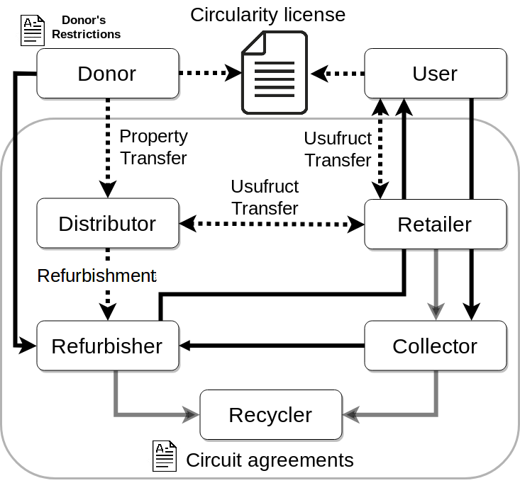

# Introducción licencias y convenios

En este documento introducimos los aspectos principales de la licencia de Circularidad de eReuse, los acuerdos de Circuito, los acuerdos de Plataforma tecnológica y las relaciones entre licencia y acuerdos. La documentos respectivos se pueden encontrar en los anexos [Llicencia Circular de eReuse.org](https://reutilitza-cat.gitbooks.io/projecte-ajuntament-barcelona-2018/content/llicencia-circular-delectronic-reuse.html), [Conveni de Circuit Reutilitza](https://reutilitza-cat.gitbooks.io/projecte-ajuntament-barcelona-2018/content/annexes/acord-de-circuit.html) i [Conveni de Plataforma Reutilitza.cat](https://reutilitza-cat.gitbooks.io/projecte-ajuntament-barcelona-2018/content/conveni-de-plataforma.html)\) y las definiciones en el anexo [Acrònims i Definicions](https://reutilitza-cat.gitbooks.io/projecte-ajuntament-barcelona-2018/content/acronims-i-definicions.html).

En la licencia se definen los principios y datos a compartir por la comunidad global de ereuse para permitir auditar la trazabilidad durante su ciclo de vida y saber en que medida se ha priorizado la reutilización al reciclaje.

En el acuerdo de de Circuito las entidades que tratan con dispositivos digitales \(cedentes, restauradoras, reparadoras, distribuidoras y recicladoras\) definen acuerdos de colaboración para compartir dispositivos y servicios. En este apartado presentamos el acuerdo marco y el modelo organizativo del circuito colaborativo Reutilitza \(sin el .cat\), con procedimientos y acuerdos para implementar la licencia, y con particularidades, por ejemplo ser sin ánimo de lucro.

El último acuerdo es el de plataforma tecnológica en donde se define la colaboración entre las entidades participantes de un circuito y las entidades proveedoras de servicios de plataforma. En este acuerdo los proveedores de plataforma ofrecen el servicio de implementar la licencia de Circularidad y los acuerdos específicos del circuito. Esto da como resultado una plataforma cooperativista que agrupa entidades de economía circular y entidades proveedoras de tecnología.

## La Licencia Circularidad de eReuse

> Resumen de los puntos incluídos en la licencia, ver licencia en el siguiente enlace.

* El común a preservar por ereuse es la información de circularidad de la electrónica.
* Establece **qué** \(principios/valores\) comparten sus miembros, haciendo una definición de **qué** és la Circularidad.
* Define **qué** información de circularidad debe ser reportada:
  1. La cadena de custodia - cuál\(es\) circuitos han sido poseedores de los dispositivos durante su ciclo de uso y a cuál gestor de residuos se ha transferido para el reciclaje final. 
  2. El valor de uso en la cadena - qué valor de uso tienen los dispositivos en los circuitos y que valor tienen cuando se transfieren al gestor de reciclaje. 
  3. El derecho a la reparación - si se permite o no la auto-reparación de los dispositivos por parte de los usuarios finales.
* Establece  **como**  debe ser reportada la información \(protocolo, datos, figuras\), sin entrar en las tenologias que deben ser empleadas. **El objetivo es que la circularidad sea auditable,**  no se está exigiendo circularidad. Los datos \(el qué\) deben ser auditables, proceder de fuentes fiables y certificables.

> Comentario Stephan: respeto al ultimo punto "como debe ser reportada la información", este punto también esta en el acuerdo de la plataforma

## [Acuerdos de circuito](introduccion-licencias-y-convenios.md)

El común a preservar por el circuito es la circularidad de los dispositivos y sus fuentes de suministro.

* Preservar la circularidad de los dispositivos implica preservar su valor de uso o incrementarlo con mejoras, asegurando su trazabilidad y reciclaje final.
* Preservar las fuentes de suministro implica cumplir los compromisos de los donantes en cuando a la tipología de actores y receptores, los costes de adquisición de los dispositivos, etc...

Aquí un resumen y esquema de los acuerdos bilaterales posibles entre los agentes de un circuito. Cada entidad usará el acuerdo segun el rol que tenga. El acuerdo de circuito es por lo tanto una colección de acuerdos que los agentes usan a modo de plantilla para definir colaboraciones entre ellos.

Los agentes de economía circular son: donante, distribuidor, restaurador, reparador, minorista \(retaielr\), usuario y reciclador. Los donantes y usuarios no participan directamente de un circuito, sinó que el donante lo hace por vía del distribuidor al circuito y el usuario por vía del minorista \(retailer\).

En el siguiente esquema se presentan los actores de economía circular que participan directa e indirectamente de un circuito, los principales acuerdos \(Documentos A: Agreement\) y el flujo de dispositivos. Los acuerdos hacen referencia a la Licencia Circular de eReuse.

\[TODO: Traducir y consolidar\]

Devices enter the CPR primarily through three channels: 1\) the collective purchase of new or used products, 2\) charitable donations from public administrations and companies, such as those of a city council seeking to feed the local economy and reuse their surpluses by target groups in vulnerable situations, 3\) donations from other members belonging to the community, some of whom specialise in carrying out these fund-raising activities \(buyback\), members of cooperatives \(e.g. Abacus.coop\), or a recycler who has stocks he cannot process internally.

Although the community is the custodian of the products, it is necessary to designate those directly responsible for the custody of the life cycle of the products. When a product enters the CPR, it must be defined who will be responsible for its remanufacturing or refurbishment \(remade by\), who will deliver it to the end user \(distributed by\), what target group of recipients it may have \(e.g. individuals, social entities\) \(reused by\), who may receive it to the end user to ensure that it does not leave the community circuit \(collected by\) and who may recycle it \(recycled by\).

In the case of new devices, \textit{distributors} frequently have a business relationship with manufacturers that they represent, while \textit{retailers} consist of small and large for-profit businesses that sell products directly to consumers \(\textit{users}\). The donor, that represents the manufacturer for new devices, donates devices free of charge to a distributor involved in a circuit. For example, the Barcelona City Council \(donor\) has a donation agreement with Pangea.org \(distributor\) a non-for-profit organisation. Pangea does not refurbish or sell \(retail\), but adds them to the common-pool of devices of a circuit. Pangea here provides the service of acquisition, distribution and management of compliance of the chain of custody for the donor.

The donor-distributor donation agreement defines restrictions that the distributor must preserve throughout the complete life cycle of the device until its final recycling. Three examples of donor restrictions could be: 1\) refurbishers and retailers must be non-profit organisations, 2\) users should be also non-profit, and 3\) price paid by the user must be cost-oriented and not profit-oriented \(e.g. price in the second-hand market\). Compliance with these restrictions is key to the preservation of the commons in a circuit. Therefore circuits must ensure that their information system allows them to report on compliance with donor agreements.

The distributor shall retain ownership of the devices until their final recycling but the usufruct will be transferred. The refurbishers in a circuit collect devices from donors and perform a basic inventory, without restoring them yet. The responsibility of collection rotates among refurbishers, and the selected refurbisher will pick all devices from a donor. The inventory is shared with retailers and they can see the characteristics and use-value of the pooled devices. Retailers choose the devices they can channel to users. The retailer-user service agreement charges all these costs to users. Retailers then compensate the distributor and refurbishers, or other agents involved with technical support and transport to the end user.

The main conflict in a common pool of devices is the quota of devices assigned to each retailer. The quota to be received by each retailer is related to its situation of compensation with the commons, which in the case of retailers is the difference between the use-value extracted and the use-value returned, for example, we assume that a retailer extract 300 use-value units \(100 devices with 3 use-value each\) but only return 100 units \(50 devices with use-value each of 2\). In order to compensate their situation, they should contribute 200 units of use value, either by providing devices to the commons with the role of distributor or by making contributions of similar value \(monetary or other equivalent\).

Finally, the user will look for the device at the refurbisher or the retailer will send it to him. Circuits define the agreement with the end user, which for example may force the receiver to return the device when it is no longer in use.

Los principales acuerdos entre los agentes son:

1. Entre Donante y distribuidor. En este acuerdo se transfiere la propiedad del dispositivo al distribuidor. El distribuidor tendrá la propiedad hasta que se transfiera al reciclador final. En este acuerdo el Donante define una restricciones especiales como pueden ser la tipología de agentes y usuarios que pueden ser usufructuarios, el precio de coste de los servicios, etc... El Distribuidor sólo transfiere el usufructo al minorista. El distribuidor imputa al minorista los costes de servicio de cadena de custodia \(10% sobre PVP\) y de la gestión del usufructo y compromisos \(7,5% sobre el PVP\). 
2. Entre Distribuidora y minorista. La distribuidora debe asegurar la cadena de custodia al donante y los compromisos que ha asumido, por lo que la distribuidora tiene la libertad de elegir con que minorista colaborar, siempre que esten dentro de las tipologías definidas por el donante en \(Donor Restrictions\). La distribuidora no transfiere la propiedad del producto sinó sólo su usufructo durante un ciclo de reutilización. 
3. Entre Distribuidora y restauradora. Aquellas distribuidoras que no tengan rol de restauradora hacen acuerdos con restauradoras para que hagan toda la recogida a los donantes. La Restauradora debe hacer un inventario básico y compartirlo \(Share with Retailers\) con los minoristas que tengan acuerdos con la distribuidora. La Restauración se realizará bajo petición del minorista. En este acuerdo la Restauradora asume el riesgo de recoger material que puede no ser reutilizable pero a cambio tiene el derecho de restaurar todo el material.
4. Entre Minoristas y Restauradoras. Los minoristas que no hagan restauración \(caso Abacus\) o que tengan necesidad oferta de dispositivos preparados \(ej Donalo\) tienen acuerdos con Restauradoras. El coste de restauración está definido la distribuidora.
5. Entre Minorista y usuario. El minorista tiene libertad de elegir los usuarios a quién transfiere el usufructo siempre que se cumplan las \(Donor Restrictions\) como por ejemplo la tipología de usuarios. El minorista tiene acuerdos con Restauradores y Reparadores para hacer la restauración y ofrecer soporte técnico al usuario final.

### Acuerdo de plataforma

El común a preservar por la plataforma son los servicios y compartir sus costes.

Cada circuito decide que software usar para implementar el protocolo de circularidad de la licencia. Los miembros tienen varias opciones. Usar sus propio software y adaptarlo a la licencia, usar las tecnologías open-source de ereuse, y por último, solicitar los servicios software-as-a-service de entidades federadas de ereuse. Estas entidades proveedoras de Saas se federan en plataformas ofreciendo servicios a los miembros de los circuitos.

Los acuerdos de plataforma y de circuito son los dos comunes locales. El común a preservar por la plataforma es ayudar a los miembros que participan a implementar el protocolo de ereuse, preservando los datos y la accesibilidad en el coste.

* La acuerdo de plataforma establece el **cómo** reportar la circularidad \(tecnologías, auditabilidad de las herramientas usadas\) y ofrece un conjunto de servicios tecnológicos para que las entidades que tratan dispositivos \(cedentes, restauradoras, distribuidoras, usuarias\) puedan realizar su labor. **El objetivo es implementar el protocolo ereuse y compartir costes**.  
* Las plataformas deciden unos costes de referencia para los servicios tecnológicos \(ej: servicio devicehub, etc...\). Las plataformas pueden decidir compensar costes comunes como el de coordinación o el de comunicación. Una plataforma puede establecer que quiere proveedores tecnológicos open-source.
* Las plataformas hospedan circuitos. Un circuito puede ser de una sola entidad \(que hace la restauración, distribución,...\) o de más de una.
* Hay partes del software, al menos las que afectan a trazabilidad y valor de uso, que deben usar programas open-source o usar software certificado que implemente el protocolo. Hay otras partes que no deben ser necesariamente open-source,
* Qué es el rendimiento de circularidad y cómo se calcula.

## Acuerdo de Circuito

* Los circuito definen el rendimiento de circularidad que desean lograr, y ofrecen los datos para que puedan ser auditados. El Circuito X recicla los dispositivos cuando el valor de uso es de 3 o 4? ¿Hay aún demanda de uso? \(sólo se contempla demanda a nivel local o tambíen internacional\). Este es el indicador de rendimiento de circularidad sería un diferenciador del circuito.
* Un circuito debe definir aspectos como el \(rendimiento circularidad deseado, atención a un conjunto de receptores, fomentar economía social, etc...\). Los circuitos comunitarios \(de más de una entidad\) definen costes de compensación por los servicios realizados sobre los dispositivos \(restauración, transporte,..\) y los servicios tecnológicos provienen de la definición de costes de plataforma. 
* Los circuitos definen las medidas que sostienen el objetivo de rendimiento de circularidad a lograr. Ej: los dispositivos que deben ser reparados y tengan un coste de reparación elevado que no cubra su valor de uso se derivan a programas de aprendizaje-servicio \(coste de reparación nulo\). 
* definir medidas para preservar/aumentar las cesiones al circuito. Serian los compromisos que los cedentes al circuito tienen con los dispositivos que ceden \(compromisos en cascada/heredados\). Para facilitar el seguimiento de compromisos se establece un documento marco de "cesión" a usar por los cedentes \(ej: Pangea como cedente al circuito usa un convenio marco de cesión \(hacia esta\) que usa con el ayuntamiento\).

