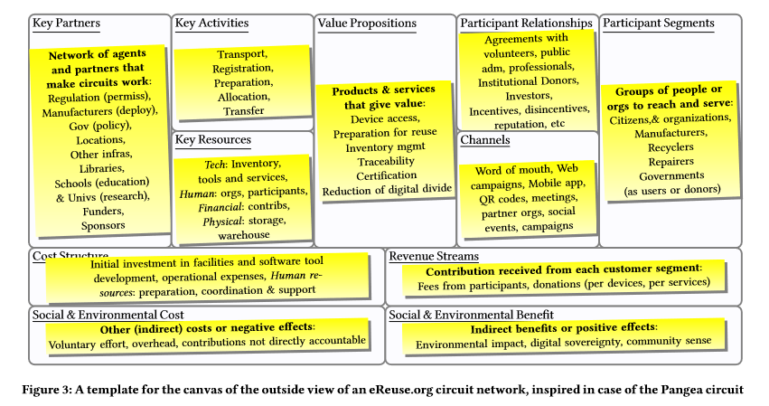
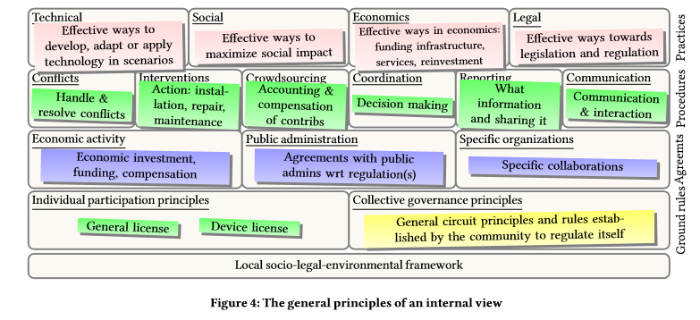

# R3.2.1 Workshop MSC 28F

Workshops

## Ordre del dia workshop Reutilitza.cat i TagItSmart

### **Amb**

* Entitats actuals de Reutilitza.cat \(Alencop.coop, Solidanca.cat, bancderecursos.org, fundacionrealdreams.org, labdoo.org, reutilitza.upc.edu, Pangea.org, jamgo.coop, engrunes.org, marianao.net, andromines.net, trinijove.org\)
* Entitats entrants \(paremanel.org, comunitaria.cat, blueterabyte.es, abacus.coop, colectic, guifi.net, Fundación Catalana del Esplai, TTN.cat, femprocomuns.cat\).
* Representants del projecte Europeu TagITSmart.eu \(coordinació, dondelotiro.com\)
* Representants del projecte Reutilitza.cat \(Ajuntament de Barcelona\)
* Presentació de noves propostes \(fablabbcn.org, jamgo.coop\)
* Experts en economia circular, col·laborativa i reutilització

Dia: Dimecres 28 de Febrer 2018 Hora: 10 a 12:30 Lloc: Pati Manning Adreça: \(C/Montalegre 7, Barcelona\).[Map](https://www.gitbook.com/book/reutilitza-cat/esdeveniments-de-reutilitza-cat/edit#)

### Registre

Us preguem que adquiriu la entrada, gratuïta, aquí[enllaç per adquirir l'entrada.](https://www.gitbook.com/book/reutilitza-cat/esdeveniments-de-reutilitza-cat/edit#)

### Context

**Reutilitza.cat:**Per a fer la reutilització viable econòmicament els actor de l'ESS estem iniciant col·laboracions, compartint recursos i dades per a poder escalar i optimitzar costos de restauració i distribució de dispositius. Però encara requerim millorar el nostre model de negoci social \(saber on aporten i com capturen el valor, crear col·laboracions, ...\) i de les necessàries millores tecnològiques que hem identificat i validat en diferents pilots. Ens hem agrupat en el Circuit Pangea \(actualment reutilitza.cat\) que volem constituir com a plataforma de propietat col·lectiva. El projecte integraria la tecnologia eReuse.org desenvolupada des del 2011 i suportada en un projecte Europeu els anys 2015 i 2016. La plataforma haurà de ser gestionada, desenvolupada i mantinguda per les entitats de l'ESS, les treballadores, les comunitats i les entitats que hi participen i en general la ciutadania. La plataforma ha de ser ser sostenible econòmicament, governada democràticament, oberta i d'adhesió voluntària, però ha de seguir uns principis d'economia social, circular i solidària, i unes regles de gestió per preservar els els béns comuns, com són els dispositius que s'han fabricat i els donants que volen cedir-los gratuïtament a la reutilització, per això cal que respongui a les necessitats i els compromisos que els donants ens fixin i obrir-la a la ciutadania i a les comunitats que puguin dotar-se d'un servei d'autoreparació i reutilització. El fi últim és el canvi cultural cap a la reparació, restauració i reutilització de la tecnologia, la xarxa de col·laboracions i l'experiència i és, ara només ens falta més tecnologia per preservar-les i amplificar-les

**TagItSmart**

Català: Una economia circular consisteix a capturar el valor perdut en els sistemes lineals tradicionals. Això implica transformar la cadena de subministrament lineal en bucles que conserven més valor. Va més enllà del reciclatge, aquesta inclou reparació, millores i reutilització de productes, on es captura més valor original amb un impacte ambiental reduït. Les economies circulars són especialment rellevants per a dispositius digitals o equips elèctrics i electrònics \(EEE\). Construïts amb materials escassos i potencialment tòxics i subjectes a reciclatge informal en el món desenvolupat i en desenvolupament, aquests dispositius s'han convertit en un problema ambiental mundial. Ens centrem en els dispositius usats recentment renovats, com ordinadors, ordinadors portàtils o mòbils. Després de la reparació i proves dels agents autoritzats, els productes renovats tornen a la cadena de subministrament, ajudant a reduir els residus electrònics. eReuse.org implica diverses organitzacions locals que gestionen milers de dispositius per a la seva reutilització. La comunitat eReuse.org ha desenvolupat una comprensió del problema, els reptes de passar a una economia circular , el valor d'una ecologia per a dispositius digitals, on la circularitat depèn críticament de la traçabilitat dels dispositius i la cooperació entre tots els grups d'interès local i global. La nostra visió és una economia circular eficient per als dispositius digitals, un esforç col·lectiu en una comunitat col·laborativa, per a un mercat sostenible des d'una perspectiva econòmica i ecològica. Aquesta comunitat es basa en processos, eines de programari, serveis web i dades obertes per a intercanvis circulars eficients, fiables i transparents amb entitats de ciutadans \(B2C\), privades \(B2B\) i administració pública \(B2A\). Pangea proposa desenvolupar el cas d'ús d'una "economia circular" de béns circulars "de moviment lent" \(SMCG\), basada en la integració de la comunitat eReuse.org amb l'ús de SmartTags i l'ecosistema TIS, on els agents intercanvien dades certificades sobre l'estat, el valor i la traçabilitat dels dispositius digitals, i realitzar un projecte pilot sobre economia circular en un entorn empresarial real.

Anglès: A circular economy is about capturing value lost in traditional linear systems. This implies transforming the linear supply chain into loops that retain more value. It goes beyond recycling, involving repair, refurbishment and reuse of products where more of the original value is captured with reduced environmental impact. Circular economies are particularly relevant for digital devices or electric and electronic equipment \(EEE\). Built using scarce and potentially toxic materials and subject to informal recycling in the developed and developing world, these devices have become a global environmental problem. We focus on refurbished used devices such as computers, laptops or mobiles. After repair and testing by authorized agents, refurbished products go back to the supply chain, helping to reduce e-waste. eReuse.org involves several local organizations managing thousands of devices for reuse. The eReuse.org community has developed an understanding of the problem, the challenges to move to a circular economy, the value of an ecology for digital devices, where circularity critically depends on the traceability of devices and cooperation among all stakeholders locally and globally. Our vision is a resource-efficient circular economy for digital devices, a collective effort in a collaborative community, for a sustainable market from an economic and ecologic perspective. This community relies on processes, software tools, web services and big open data for efficient, trustworthy and transparent circular exchanges with citizens \(B2C\), private \(B2B\) and public administration \(B2A\) entities. Pangea proposes to develop the use case of a “Circular Economy” of “slow moving” circular goods \(SMCG\), based on an the integration of the eReuse.org community with the use of SmartTags and the TIS ecosystem where stakeholders exchange certified data about the status, value and traceability of digital devices, and perform a pilot project about circular economy in a real business environment.

### Objectius

* Motivar a les entitats a participar en el codisseny de la plataforma / circuit
* Esborrany de conveni per adherir-se a reutilitza.cat \(definició de la missió de reutiliza.cat\)
* Fomentar la intercooperació entre entitats per intercanviar serveis i dispositius
* Detectar aspectes que les entitats necessiten per millorar la seva activitat en el marc de l'economia circular
* Com sistematitzar la recollida de propostes de millora de les entitats
* Resoldre qüestions pràctiques del funcionament de la plataforma

### Possibles impactes i sinergies

* Entitats \(nº\) que subscriuen la llicència del circuit Reutiliza.cat
* Mapeig de serveis oferits per entitats i intercanvis possibles
* Definir la missió de la plataforma reutiliza.cat
* Introduir els nous membres i les noves iniciatives dels actors participants

### Esborrany Agenda

**De 10 a 11:30 Funcionament i governança de la plataforma Circuit Pangea / reutiliza.cat**

* \(5\`\) Presentació jornada, David Franquesa
* \(5'\) Presentació projecte Reutilitza.cat, David Franquesa \(esquema de circuits\)
* \(15'\) Presentació assistents i entitats del circuit, moderació Mireia Roura
* \(50'\)
  * \(5'\) DAFO sobre l'estat actual del circuit i oportunitats de la plataforma \(Mireia Roura\)
  * \(10'\) Predefinició de la missió de reutiliza.cat i fases prèvies a l'adhesió al conveni de reutilitza.cat \(David Franquesa\)
  * \(25'\) Tallers i dinàmiques participatives \(Stephan Fortelny\)
  * \(10'\) Proposta de governança: el cas Guifinet i la seva aplicació a reutilitza.cat \(Leandro Navarro, guifinet\)
* \(15'\) Torn de precs i preguntes

De 11:30 a 11:45 descans

**De 11:45 a 12:30 Tecnologia de la plataforma**

* Introducció, Xavier Bustamante \(Pangea\)
* \(15'\) Millores i propostes tecnològiques
  * \(5'\)**Marketplace economia social**, Javier Legido, Jamgo
  * \(5'\)**Photobox,**Fablabbcn \(pendent de confirmació\)
  * \(5'\)**Classificació automàtica d'imatges del DeviceHub**Basetis
* \(10´\) Pangea \(Devicetag.io\) Xavier Bustamante
  * \(5'\)**Nova versió Workbench**
  * \(5'\)**Noves funcionalitats**
* \(15'\) Projecte TagItSmart.eu, Iván González \(dondelotiro\)
  * Pilots a realitzar
  * Tecnologia a desenvolupar
    * Integració al projecte TagItSmart
    * Mòduls a utilitzar del TagItSmart
    * Etiqueta fotocromàtica/...
* \(5'\) Torns de paraula

### Participants i entitats

* Solidança
* Trinijove
* Fundació Marianao
* Alencop
* Abacus cooperativa
* Blueterabyte
* Comunitària
* Jamgo
* dondelotiro
* Agencia de Residus de Catalunya \(Àrea Prevenció\)
* Direcció General de Societat Digital \(Generalitat\)
* Fem procomuns
* TTN.cat
* Fundació catalana de l'esplai
* Banc de Recursos
* Guifi.net
* Universitat Politècnica de Catalunya
* TagITSmart.eu
* donalo.org
* Direcció de Serveis d’Economia Cooperativa, Social i Solidaria i Consum \(Ajuntament Barcelona\)
* BaseTIS
* Engrunes
* Andròmines
* Pangea
* **Bibliografia / documents anexes**

_\*\* Aquest esdeveniment està realitzat amb finançament de la Unió Europea i de l'Ajuntament de Barcelona. El seu contingut és responsabilitat de Pangea.org_

## Acta workshop eReuseCatalunya i TagItSmart \(28F, MSC\)

### 1\) DAFO sobre l'estat d'eReuse \(i breu introducció\)

Electronic reuse \(ereuse.org\) és una **comunitat de gestió col·lectiva** on els [participants ](https://github.com/reutilitza-cat/projecte-ajuntament-barcelona-2018/tree/8748c954ce56b4055426b960c372e9d56ee5511a/entregables/www.ereuse.org/community/README.md) intercanvien recursos procomuns per a fomentar la **reutilització**, la **traçabilitat** i el **reciclatge** final de dispositius digitals com ordinadors, portàtils o telèfons mòbils. Aquests recursos, en **format lliure i de codi obert**, i tot un seguit de **serveis distribuïts**, són utilitzats per vàries entitats que prèviament s'han federat a eReuse per implementar **circuits locals autogestionats**. 

Les entitats adherides a eReuse, al marge de que implementin, o no, circuits autogestionats, subscriuen una [Llicència Circular, que s'està treballant aquí](https://ereuse-org.gitbook.io/ereuse-licenses/electronic-circular-license/spanish), per assegurar que no es fa reciclatge prematur i que tot el que es reutilitza acaba reciclant-se formalment. Aquesta llicència estableix que el comú a preservar és la **informació de circularitat de la electrònica**. A grans trets, defineix **quina informació de circularitat ha de ser reportada** per tots els membres subscrits. És a dir, qualsevol membre que ha subscrit la llicència ha de fer pública la informació que demostra que ha aplicat bé la jerarquia de les 3R \(reduïr, reutilitzar, reciclar\); doncs com a eReuse entenem que només és circular desbastellar un dispositiu electrònic si abans s'ha intentat fer les accions de reparació, millora i reutilització A grans trets, subscriure aquesta llicència implica: 

1\) **Poder reportar la cadena de custòdia**: quins circuits /entitats han tingut els dispositius durant el seu cicle d'ús i a quin gestor de residus s'ha transferit pel seu reciclatge final.

2\) **Demostrar el valor d'us de la cadena**: quin valor d'ús tenen els dispositius als circuits i quin valor d'ús tenen quan són transferits al gestor de reciclatge.

3\) **Garantir el dret a la reparació**: en tot cas, el dret a la autoreparació pels usuaris finals està permès.

Algunes de les eines desenvolupades en el marc d'eReuse són:

a\) **Tecnològiques**: a1\) **Workbench** \(software que ajuda al diagnòstic i l'inventari de dispositius digitals que processa informació detallada de hardware a nivell de component; a2\)**DeviceHub** \(Device Asset Management System\) que ofereix una aplicació web i està enfocat a administrar de manera eficient el cicle de vida circular dels dispositius. Aquestes eines s'han anat desenvolupat des del 2011, suportades per projectes europeus els anys 2015, 2016 i 2018.

b\) **De protocol i gestió**: b1\) **Convenis tipus** per formalitzar donacions, intercanvis de productes i serveis i cessions en comodat a entitats receptores; b2\) **Propostes de compensacions de preus**; b3\) **Propostes de de procediment**.

Com ja s'ha esmenetat, les entitats federades a eReuse s'agrupen en **Circuits locals** i autònoms on els dispositius es gestionen i posseeixen de **manera col·lectiva**. **La propietat del dispositiu no resideix en l'usuari sinó en una comunitat que en fa la custòdia de reutilització i traçabilitat fins al reciclatge final**. Els dispositius només es reciclen quan el seu valor d'ús és baix o ja no hi ha demanda de reutilització.

Un **circuit** és auto-gestionat, procomú, d'adhesió voluntària i es gestiona democràticament. La col·laboració que s'origina en un Circuit permet a les entitats **escalar**, **cooperar** i **compartir** ordinadors per **equilibrar oferta i demanda**. Un Circuit pot fer ús del codi lliure de eReuse. Aquestes eines i serveis els ajuden a optimitzar i certificar els processos i la traçabilitat dels dispositius durant el cicle de vida. Les eines estan desenvolupades en programari lliure, les entitats poden implementar-les per elles mateixes o accedir a proveïdors tecnològics, sempre federats a eReuse, que les creen i ofereixen en modalitat de serveis de programari.

Aquestes eines i serveis els ajuden a optimitzar i certificar els processos i la traçabilitat dels dispositius durant el cicle de vida.

La Mireia Roura, de l’equip d’eReuse, explica que, juntament amb l’Stephan Fortenly, han entrevistat un total de **vuit entitats** amb l’objectiu de fer un DAFO sobre l’estat d'implementació d'aquestes eines i començar a codisenyar la plataforma i el seu model de governança. ****[**El resum d’aquestes vuit entrevistes es pot veure aquí**](https://nextcloud.pangea.org/index.php/s/Bmzi7Kjf2MXjTyI)**.** 

[**Sobre el resultat d’aquestes entrevistes s’elabora un DAFO que es pot veure aquí**](https://nextcloud.pangea.org/index.php/s/VqWVJGOYzlYAZOp)

### 2\) BREU EXPLICACIÓ DEL PROJECTE

En David Franquesa, coordinador d’eReuse, exposa breument el projecte de l’Ajuntament de Barcelona i la plataforma cooperativista de reutilització d’ordinadors. ****[**Podeu veure el projecte complet aquí**](../proposta-lliurada/proposta.md)**.** Com a resum, l'objectiu principal del projecte és **desenvolupar una plataforma** **col·laborativa procomú** per a la reutilització de dispositius digitals que enforteixi el sector de l'EES fomentant la intercooperació i no la competència dels seus actors.

El projecte d'enguany es centra en **definir** i **impulsar** un **circuit** a **Barcelona** i la seva àrea metropolitana, d'adhesió lliure d'entitats d'economia social i solidaria, moviments del barri, comunitats i iniciatives solidàries i institucions educatives en aprenentatge-servei.

Les entitats participants del circuit han de consensuar un **acord de col·laboració**, que s'està treballant en aquest espai "[**Conveni de Circuit eReuse Catalunya**](https://www.gitbook.com/book/reutilitza-cat/projecte-ajuntament-barcelona-2018/edit#/edit/master/annexes/acord-de-circuit.md?_k=yo3y52)", que conté uns principis fonamentals, definicions i acords específis de col·laboració entre els agents de l'ESS. Aquest document, en elaboració, conté totes les possibilitats d'acord bilaterals entre les entitats, defineix els rols i les obligacions de les parts amb l'objectiu de regular l'accés a dispositius digitals. Així mateix, estableix normatives, procediments i guies, entre d'altres, per facilitar la intercooperació.

Les entitats del circuit poden utilitzar la tecnologia de eReuse per ells mateixos, les seves pròpies eines \(certificades\) o usar els serveis de proveïdors de tecnologia federats a eReuse. La relació entre les entitats del Circuit i els proveïdors de plataforma es defineix en aquesta primera versió a treballar de forma col·laborativa: [**Conveni eReuse Catalunya**](https://www.gitbook.com/book/reutilitza-cat/projecte-ajuntament-barcelona-2018/edit#/edit/master/conveni-de-plataforma.md?_k=3sest2).

### 3\) POSSIBILITATS D’INTEGRACIÓ A LA NOVA PLATAFORMA eReuse.cat

L'Stephan ens explica les diferents possibilitats de participació com a entitat federada a eReuse. Dins d'aquesta comunitat hi ha els proveïdors de serveis, com ara BaseTIS, Jamgo, Pangea; en tot cas, tots han subscrit la llicència circular. 

Aquesta llicència també l'han subscrit totes les entitats que desenvolupen qualsevol rol \(restauradors, distribuïdors...\) i que s'agrupen en circuits locals. En tot cas, aquestes últimes entitats també subscriuen el Conveni de Circuit eReuse Catalunya. El nivell d'implicació d'aquestes entitats, susceptibles a agrupar-se en circuits, però, pot ser diferent:

1\) **Participació amb circuit intern**: són aquelles entitats que poden desenvolupar tots els rols sense intercanviar serveis ni dispositius amb cap altre entitat.

2\) **Participació esporàdica**: són entitats que intercanvien serveis o dispositius de forma esporàdica per fer front a una punta d'oferta o a una necessitat puntual de demanda.

3\) **Participació estratègica al circuit**: són entitats que necessiten necessàriament d'altres entitats per poder desenvolupar la seva activitat.

[**Veure aquestes possibilitats en aquest gràfic**](https://nextcloud.pangea.org/index.php/s/qUbjnTJ2GieEmZP)**.** 

### 4\) PRESENTACIÓ DELS ASSISTENTS

#### 4.1\) [Solidança ](http://www.solidanca.cat/)\(Miquel Caballé\)

Solidança és una empresa d’inserció laboral que, bàsicament, acompanya persones en risc i d’inserció en la seva formació fins que s’incorporen a una empresa ordinària. Fa tres anys que utilitzen l’estàndard eReuse com a restauradors, preparadors per a la reutilització i gestors de residus. Han rebut ordinadors procedents de Barcelona Activa, alguns ja redistribuïts, i la seva tasca principal ha estat la de fer proves dels nous desenvolupaments. El seu rol dins del circuit seria el de restauració/ recicladors, i no estan interessats en la captació, ni en la distribució.

#### 4.2\) [Alencop](http://alencop.coop/) \(Jordi Sebastian i Tidian\)

Alencop és una cooperativa que rep el suport de l’Ajuntament de Barcelona i que fa recollida selectiva de productes tecnològics en transport verd \(tricicles\). Operen a Sant Martí, Sant Andreu i ara estan començant a l’Eixample dret. Porten un any federats a eReuse i treballant amb el Workbench. No obstant, degut a que porten 4 mesos d’obres i en bypass per una mudança, actualment no compten amb espais per poder restaurar ordinadors. Tornaran a recomençar al març/abril i el seu rol serà de transport, reparació i distribució.

#### 4.3\) [dondelotiro.org](c:/Users/balle/Nextcloud/eReuse/5.%20Dissemination%20and%20promotion/Events/Workshops/2018-02-28%20MSC/publico/dondelotiro.com) \(Ivan González y Thomás\)

Dondelotiro és una plataforma educativa i informativa gratuïta que neix per donar resposta als dubtes en matèria de residus dels consumidors. No han tingut relació amb ereuse, però ara la tindran ja que participaran conjuntament en el projecte europeu TagIsmart. A eReuse.cat podria fer el paper de difusió al consumidor o d’un canal de comunicació més dins del circuit.

#### 4.4\) [Servei d’Inclusió i Capacitació Digital](http://sac.gencat.cat/sacgencat/AppJava/organisme_fitxa.jsp?codi=14086) \(Direcció General de Societat Digital, Generalitat\) Mónica Acebo

La Mònica ve en representació de la Generalitat i fa menció al projecte CoreTIC, impulsat per la Generalitat per sensibilitzar a empreses del sector TIC i institucions sobre les possibilitats de la reutilització en ordinadors. Actualment, aquest projecte s’està reformulant juntament amb l’Agència de Residus de Catalunya \(ARC\) i altres partners per a la reutilització de mòbils.

#### 4.5\) [Agència de Residus de Catalunya](http://residus.gencat.cat/ca/inici/index.html) \(Belén Gallego\)

La Belén treballa al departament dels RAEE. Parla de que els productors actualment són responsables de finançar la recollida i preparar per a la reutilització el 4%. Estan treballant també al CoreTIC juntament amb els SIGS per tal puguin implementar una part del projecte. Estan interessats en utilitzar les eines de eReuse.

#### 4.6\) [Guifinet](c:/Users/balle/Nextcloud/eReuse/5.%20Dissemination%20and%20promotion/Events/Workshops/2018-02-28%20MSC/publico/Guifi.net) \(Leandro Navarro\)

El Leandro Navarro és el vicepresident de Pangea, professor a la UPC, on treballen la reutilització d’ordinadors des de fa 15 anys, també a través d’assignatures i doctorats, i un dels fundadors de Guifi.net, una xarxa de telecomunicacions lliure, oberta i neutral, majoritàriament sense fil, amb més de 32.900 nodes. Poden aportar recerca i experiència en governança en procomuns.

#### 4.7\) [Fundació Trinijove](http://trinijove.org/) \(Marc Serrano\)

La Fundació porta 10 anys fent recollida i reciclatge i, recentment, han adquirit una nau a Poble Nou com a centre gestor de residus electrònics. No saben encara quin rol podran tenir, però treballen sobretot en temes de formació.

#### 4.8\)  [ColecTIC ](http://colectic.coop/)\(Fèlix Casanellas\)

ColecTIC és una cooperativa localitzada al Raval. El seu motiu de ser és l’educació no formal, però recentment estan fent també preparació d’equips informàtics amb l’objectiu d’oferir una oportunitat d’inserció laboral als joves \(PCIs de manteniment informàtic\). Podrien fer la part d’assessorament telemàtic o de suport al software lliure.

#### 4.9\)  [Engrunes ](http://engrunes.org/es/c/bienvenido-3)\(Marcos Gonzàlez\)

Engrunes porta 35 anys en temes de residus. És com un germà per Solidança. Volen reprendre el tema d’eReuse, però porten un any tramitant la llicència de gestor de residus. El seu objectiu és crear una empresa juntament amb Solidança i Andròmines per fer preparació de RAEEs. I el seu rol dins de la plataforma podria ser el de recollida \(transport\), desballestament i restauració \(tenen un tècnic que podria fer aquesta última tasca\). El Marcos diu que aquesta empresa podria estar integrada dins d’eReuse

#### 4.10\)  [Fundació Marianao](http://www.marianao.net/ca) \(Mercè Hernández i Marc\)

A Fundació Marianao hi ha un PCI en muntatge i manteniment d’equips informàtics. Alguns d’aquests, van destinats a familiars de beneficiaris de les entitats. Estan vinculats a eReuse però de forma no massa sistematitzada.

#### 4.11\) [donalo.org](https://github.com/reutilitza-cat/projecte-ajuntament-barcelona-2018/tree/8748c954ce56b4055426b960c372e9d56ee5511a/www.donalo.org)  \(Ricard Gil i Mireia Roura\)

Donalo.org és un punt de trobada on les empreses donen els seus excedents a entitats sense ànim de lucre. Des de fa prop d’un any i mig utilitza les eines eReuse a nivell de circuit privat; tot i que també fa intercanvis de béns i serveis amb altres organitzacions. Després d’un any de pràctica, estan aconseguint consolidar el lloc de feina del Ricard que pot fer uns 7 ordinadors al dia quan el sistema funciona.

#### 4.12\) [BaseTIS ](https://www.basetis.com/es)\(Albert Mercader, Pere Miquel Brull, Arnau Villoro\)

La consultora catalana ha col·laborat en diverses vegades amb el Tercer Sector, per exemple, fent una app a Arrels i una solució tecnològica per Sport2Live. La seva contribució dins de eReuse consisteix en construir un algoritme que especifiqui l’estat físic dels dispositius. Els tres venen d’analítiques.

#### 4.13\) [Blueterabyte](https://blueterabyte.es/la-fundacion/) \(Antonio \)

Porten 20 anys en temes de restauració de RAEES i electrodomèstics. Per aconseguir el residu zero es centren en l’educació dels joves \(a tots els nivells\) i estan molt vinculats a la feina amb xatarra. Han format a uns 15.000 joves a través de l’apertura de diversos centres de restauració i formació. Estan molt agraïts que s’estigui creant una xarxa d’economia col·laborativa i d’intercanvi de béns i serveis. Han entrat a eReuse fa poc i estan utilitzant el workbench i volen participar en tot i amb tots els rols.  
Són bon coneixedors del mercat del renting. Parla de que actualment n’hi ha pocs \(a Espanya uns 3 o 4\), donat que és un mercat molt tancat i Espanya no absorbeix. Parla que els fabricants no volen que es generi un mercat de reparació ja que els treu mercat.

#### 4.14\) [Fundación esplai](http://fundacionesplai.org/) \(Gabriel González\)

Entitat integrada dins de Fundesplai que dona servei, proveint d’ordinadors, per exemple, a la Red de Telecentros, que té l’objectiu de fomentar la inclusió social de totes les persones utilitzant les TIC. L’any passat van fer l’adquisició de varis PC a una de les entitats federades a eReuse; tot adquirint el doble de dispositius pel mateix pressupost que s’utilitzava per la compra de nous. A partir d’aquell moment, estan mirant com integrar-se a eReuse i al circuit.

#### 4.15\) [Ayuntament de Barcelona, Barcelona Activa](http://ajuntament.barcelona.cat/premsa/2017/03/02/barcelona-activa-es-compromet-amb-leconomia-circular-i-tanca-un-acord-per-allargar-la-vida-util-de-dispositius-tecnologics-en-desus/) \(Pau Roldán\)

L’Ajuntament de Barcelona,a través de Barcelona Activa, ja dona ordinadors al circuit comú de gestió. Estan promovent el consum responsable i col·laboratiu de dispositius i impulsant la reutilització. La idea és fer el mateix a la llarga des de l’Ajuntament.

#### 4.16\) [TTN.cat ](https://thethingsnetwork.cat/index.php/The_Things_Network_Catalunya)i [fempromocuns](https://www.femprocomuns.cat/) \(Wouter Tebens\)

Des de femprocomuns, una cooperativa per l’economia del procomú, fa anys que estan parlant de fer un grup de consum de dispositius i ho veuen com una eina perquè la gent sigui sostenible. Caldria veure internament quina gent voldria participar d’eReuse per proveir de determinats serveis al circuit.  
Sobre TTN.cat, en Wouter és cofundador de la xarxa comunitària de l’internet de les coses, una xarxa global i mundial \(són unes 30.000 persones\). Se sembla bastant al model de Guifinet.

#### 4.17\) [Abacus cooperativa](https://online.abacus.coop/) \(Antonio Naranjo\)

Abacus fa 50 anys que serveix a botigues, escoles, particulars... i volen transformar el consum de manera col·laborativa, sostenible i social. La seva implicació dins d’eReuse consisteix en captar ordinadors dels seus socis/o no socis a les botigues, als que se’ls compensa amb uns abacs. Aquests PC són entregats a Solidança o Alencop per tal siguin preparats per a la reutilització. Posteriorment, són distribuïts a escoles. Ara han de veure si els pilots que estan fent es poden escalar i si els números surten. Ells no volen saber res de la gestió interna; el que demanen és que funcioni i que es doni resposta a entitats com ells en temes de qualitat i normatives \(compliment de la protecció de dades\). La seva principal preocupació és que, quan escalin, hi hagi demanda. Si no hi ha un equilibri entre la oferta i la demanda, al seu judici, el sistema fracassarà.

#### 4.18\) [jamgo.coop](http://jamgo.coop/es/) \(Xavier Legido\)

Jamgo fan software. No són experts en temes de restauració o reutilització. Comenta que la “pastanaga” és molt gran, al mateix temps que molt complexa, i que pot convertir-se encara més en alguna cosa més gran. Les oportunitats vinculades a la reutilització, per a ell, són la supervivència pura. Davant d’aquesta complexitat, ell és partidari de que rebaixem el nivell per fer-ho més fàcil d’entendre. També apunta al desequilibri de gènere. I comenta, per últim, la idea que tenen de fer un Marketplace de l’economia social, per la qual no tenen fons, ja que hi ha una oferta potent de productes i la hipòtesis és que hi ha demanda segur. Per ell, caldria fer un Amazon alternatiu. [**En aquest link podreu veure la proposta de Marketplace.**](https://nextcloud.pangea.org/index.php/s/2nhLQAWgb3gzpZ9)

#### 4.19\)[ Restarters](http://restartersbcn.info/) \(Stephan\)

Restarers organitza restars partys, esdeveniments públics en el que voluntaris amb habilitats tècniques ajuden a persones assistents a aprendre a reparar els seus aparells elèctrics i electrònics espatllats.

### 5\) MARC DEL MODEL DE GOVERNANÇA

El Leandro Navarro proposa fer una estructura de **governança àgil** on a mesura que et vagis integrant com a organització, la cosa es vagi complicant més \(i vagis signant papers\). Proposa no avançar problemes que encara no s’han patit. Justament, acaba de publicar un paper sobre la xarxes comunitàries organitzades a nivell de procomuns \(Kanbas/model de negoci\). Hi ha dos diagrames:

* **Extern**: com interacciona eReuse/ eReuse.cat amb el seu exterior. En aquest, s’ha de respondre a preguntes com:
* Quin són els costos/beneficis socials i ambientals
* Què oferim \(producte\) a les entitats externes
* Quines entitats externes cal perquè funcioni la xarxa
* Qui ens dona els permisos
* Què fem: reparar equips
* Quins recursos són necessaris
* Com ens relacionem amb els usuaris \(a través de quins canals\) i quins són aquests segments d’aquests usuaris

* **Intern**: són les regles del joc del circuit de col·laboració on hi ha un model però també poden coexistir molts models de negoci \(cada un amb el seu\) i tot sota un mateix paraigües. En el cas de Guifinet, tot estaria sota el paraigües de la Fundació Güifinet, i gràcies a aquest paraigües, es pot competir, per exemple, amb Telefònica. En aquest model s’intenta estipular coses que s’han d’estipular. En la teoria tradicional dels bens comuns, es parla de la gestió d’un bosc. Aquí és més fàcil trobar regles del joc per gestionar-ho. Però si estem davant d’una xarxa de telecomunicacions, la cosa es complica. I no podem seure cada vegada per i discutir cada cas. Ha de ser una estructura àgil. No avançar problemes i solucions al problemes, sinó trobar-te’l i trobar soluciones que et permetin ser àgils.
* Entorn
* Regles base: les regles base, seria com la llicència de participació en els comuns
* Principis de governança: com decidim, com es prenen les decisions: fem reunions, fem assemblees?
* Hi ha acords però no són necessaris per tothom. Hi hauria, per exemple, un apartat que només seria necessària pels distribuïdors, \(els altres ja ni s’ho han de mirar\), o un altre amb acords pels que fan tractes amb l’administració pública \(no cal que s’ho miri tothom\). A base de pràctica, quan ja s’han fet 2 o 3 acords, llavors es genera una plantilla
* Procediments específics: com ens comuniquem, com reportem la traçabilitat, com prenem les decisions, com aportem els diners per tenir recursos per fer créixer el comú, com es ressolen els conflictes. Per exemple, Guifinet té voluntaris; aquests no cal que es llegeixin tots els procediments, només la seva intervenció, que la tenen clara. Limits: es molt important que n’hi hagi, i així ho va dir la Eleonor Ostrom: són necessaris per preservar el com. Sense ells, per exemple, Guifinet, no existiria.
* Principis/pràctiques: seria el que sabem què funciona o no \(patrons o no patrons\). Els patrons són models socials \(o formes\) que fan que la pràctica sigui sostenible i que determinen com es posin en pràctica certes coses. Es necessita agilitat perquè la cosa funcioni. Si no funciona, els meus treballadors no cobraran a final de mes. La idea és tenir una estructura que ajudi a fer la feina però no posar traves i que no sigui un sistema anàrquic, ni massa regulat, perquè en el segon cas no funcionaria ja que estaria massa regulat
* Compensació: cada integrant reporta els recursos que ha posat i en base a això es van fent compensacions.

Aquesta part s'està adaptant a ereuse i s'est treballant en l'entregable [r1.2-principis-llicencies-i-governanca](r1.2-principis-llicencies-i-governanca/)

### 6\)TALLER PARTICIPATIU: INTERCANVI DE SERVEIS

### 7\)PRESENTACIÓ DE LES NOVES EINES

En Xavier Bustamante obre aquesta secció que està dedicada a les noves eines que s'han desenvolupat en el marc de eReuse. Posa èmfasi en la Photobox desenvolupat conjuntament amb BaseTIS i Fablab Barcelona \(que s'explica a continuació\) , en el passaport digital i físic que portarà cada ordinador restaurat amb el projecte europeu i en el Global Record of Devices.[ **Aquí es pot veure de manera gràfica les eines esmentades.** ](https://nextcloud.pangea.org/index.php/s/6VxcgxqLoj48BWR)

#### 7.1\) BASETIS

L’encàrrec era agilitzar el procés de catalogar a nivell estètic l’estat en el que es troben els PC susceptibles a ser recirculats. A partir del disseny proposat per Fablab \(com un microones gran\) s'estan generant **8 imatges de cada PC** des de diferents angles per tal de reportar quants imperfectes té \(cops, ratllades i decoloracions\), ja que aquests poden ser condicionants que afecten al preu. Aquests in puts s’envien al cloud d’eReuse, i el request permetria tenir en viu una qualificació objectiva de l’aparell que condicionaria no subjectivament el seu preu.

No s'està parlant d’un procés determinista, sinó probabilístic, pel que es faran servir tecnologies que estan en boca de tota la comunitat del DataScience: l’aprenentatge automàtic \(deep learning, que és com un procés on es posen totes les neurones juntes perquè treballin més ràpid\).

#### 7.2\) DONDELOTIRO \(PROJECTE EUROPEU\)

eReuse acaba d'entrar a un projecte europeu TagITSmart enmarcat dins Horizon2020, compta amb un pressupost de **7 milions d'euros** i amb molts partners. Es tracta de fer una plataforma d'objectes d'internet de les coses basats en etiquetes intel·ligents. Es pretén aplicar una tecnologia \(etiquetes funcionals, com les fotocròmiques, RFID, MAtric, RFD; darrere de les quals hi ha blockchange i intel·ligència artificial\) que avui dia ja existeix i estendre-la a nous casos d'ús.

Al projecte hi ha **15 socis**, inclosos socis molt grans com Unilever, Fujitsu, Siemens, i socis molt petits com dondelotiro. A la primera open call, van entrar 6 socis més; i a la segona, uns altres 6, inclòs eReuse.

dondelotiro es mou en el sector del reciclatge, i intenta donar una solució a qualsevol tipus d'objecte en desús o que és ja un residu. Compta amb 150 entitats a Espanya i un partnership al Regne Unit i 10.000 usuaris al mes que entren a la seva pàgina web. El seu objectiu és convertir-se en una plataforma de referència: aglutinar la informació d'un client, adaptar-la al seu sistema, i tornar-la als ciutadans o a entitats com Unilever, Carrefour o eReuse, mateix.

Hi ha varis casos d'ús al projecte europeu. El primer, per exemple, és el d'una cervesa; seguir-la des de la seva fabricació, distribució.. a través de les tintes termocròmiques. El segon podria ser, el de donar eines per a que els ciutadans reciclin i obtenir informació de valor per que els productes puguin millorar l'ecodisseny, la reutilització...

Un tercer cas d'ús és el de la protecció de la marca; per exemple, en el cas del vi, marcant les ampolles amb tintes fotocròmiques gairebé impossibles de falsificar. Un quart cas d'ús seria utilitzar les etiquetes per veure, per exemple, si una safata de carn està a punt de caducar i poder abaratir el seu cost. El cinquè seria el dels Home Services.

El projecte europeu posa les regles del joc; si els partners o altres clients volen posar les etiquetes, ho han de fer d'una determinada manera. Han d'entendre que cada cas d'ús és diferent. L'any passat el projecte europeu va fer proves internes dins dels laboratoris, aquest any ho estan fent en entorns controlats i es començarà a aplicar-les en pilots reals.

En el cas d'eReuse es proposa un cas d'ús basat el la integració de la etiqueta TaglSmart amb l'objectiu que els stakeholders puguin intercanviar i accedir a dades certificades sobre el estatus i traçabilitat dels ordinadors a recircular.

[**Aquí podreu veure la presentació del projecte europeu.** ](https://nextcloud.pangea.org/index.php/s/8jrWW91M3zNtHeK)

